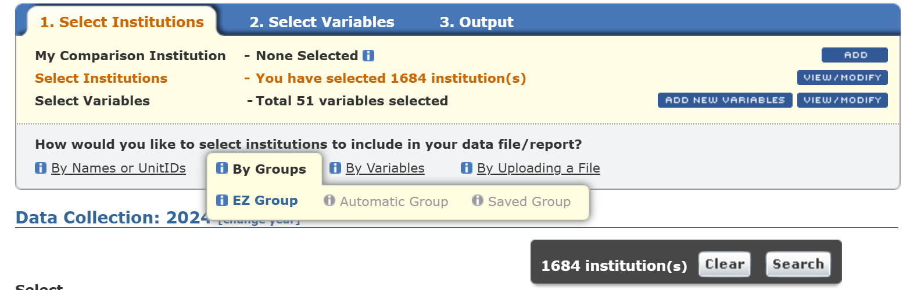
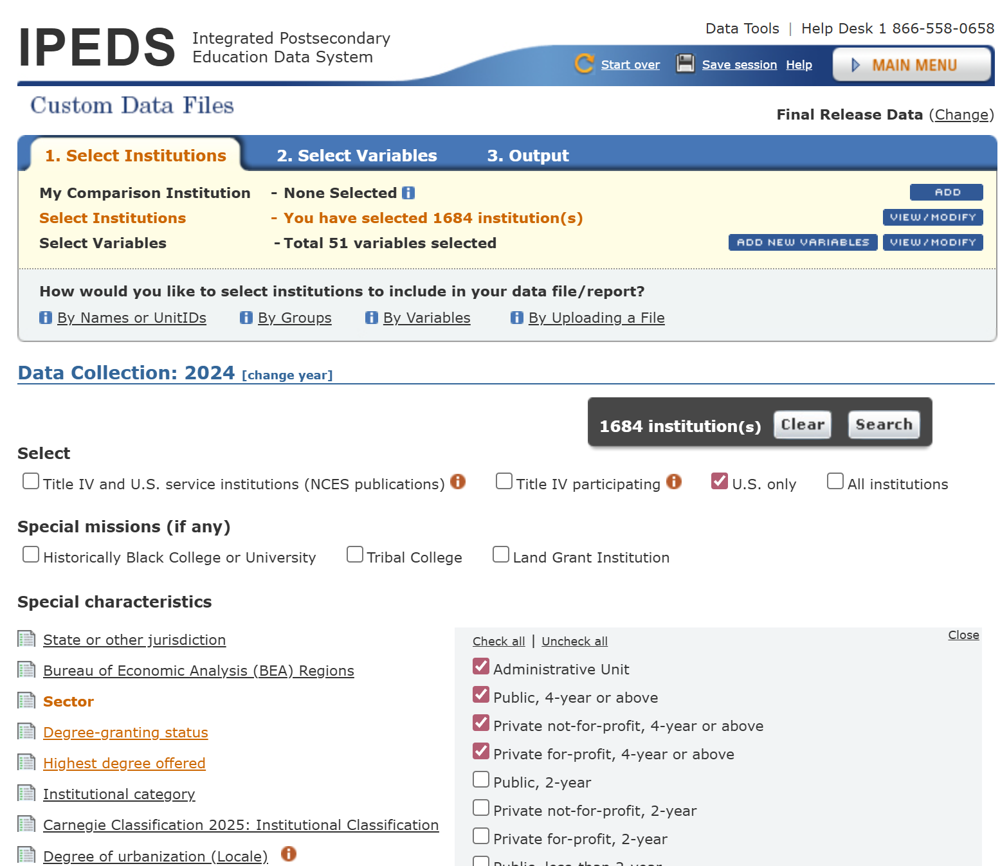
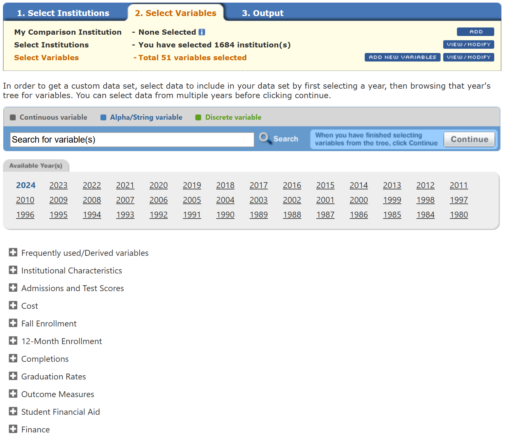
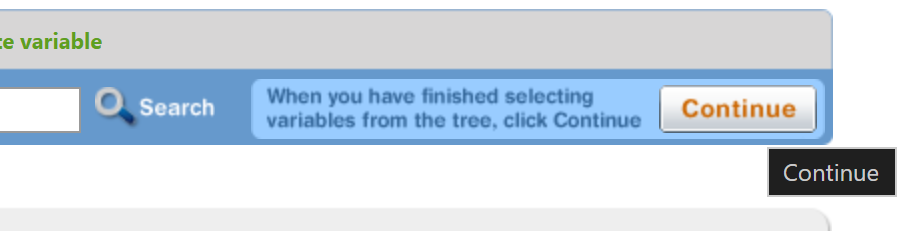
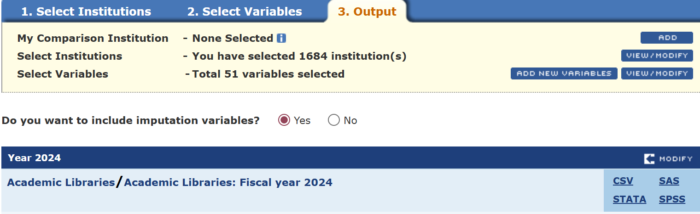

# Data Collection from IPEDS

This is how we collect data in the `./data/custom_data/` folder.

---

Link to [IPEDS Custom Data](https://nces.ed.gov/ipeds/datacenter/InstitutionByGroup.aspx?sid=ad9c97f0-296f-4395-99f5-5861fe4e5bf1&rtid=5)

## 1. Select Institution

### Criteria Summary
- **Data Collection Year:**
2024

- **Miscellaneous Indicators**
U.S. only

- **Institution size category**
1,000 - 4,999; 5,000 - 9,999; 10,000 - 19,999; 20,000 and above

- **Sector**
Public, 4-year or above; Private not-for-profit, 4-year or above; Private for-profit, 4-year or above; Administrative Unit

- **Degree-granting status**
Degree-granting

- **Highest degree offered**
Doctor's degree - research/scholarship and professional practice; Doctor's degree - research/scholarship; Doctor's degree - professional practice; Doctor's degree - other; Master's degree; Bachelor's degree

## 2. Select Variables

- Choose Year
- Expand the (+) 
- We collect data for
    + Institutional Characteristics
    + Admissions and Test Scores
    + Cost
    + Fall Enrollment
    + 12-Month Enrollment
    + Completions
    + Graduation Rates
    + Outcome Measures
    + Student Financial Aid
    + Finance
    + Instructional Staff/Salaries
    + Fall Staff
    + Employees by Assigned Position
    + Academic Libraries
- Use *Select All* for quick select:
    
- Click *Continue* when finished selecting variables:
    

## 3. Output
- You will see summary of how many institutions and variables you selected.
- We always include **imputation** variables.
- Click **CSV** to download the zip folder that includes the raw data in csv and a pdf explaining the data.

---
## Other methods
We first used this [page](https://nces.ed.gov/ipeds/datacenter/DataFiles.aspx?year=2024&sid=ad9c97f0-296f-4395-99f5-5861fe4e5bf1&rtid=7) to get the specific tables from IPEDS but this method can give you duplicated columns and does not do the filtering institutions like we want, since we only want 4-year undergraduate colleges. We had to use the `data_cleaning.Rmd` to clean the tables.

The raw full database is too huge to work with or upload to Github.